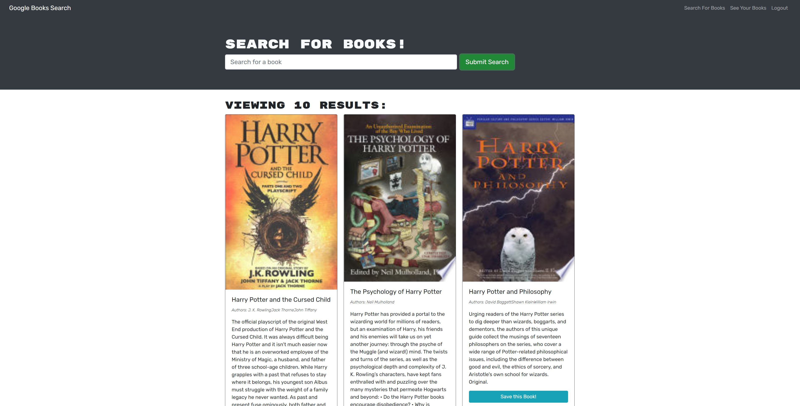

# tb-book-search

## Table of Contents:
  - [Description](#description)
  - [Deployment](#deployment)
  - [Screenshot](#screenshot)
  - [License](#license)
  - [Built With](#built-with)
  - [Contributing](#contributing)
  - [Questions](#questions)

## Description
A MERN stack book search engine where a user can create an account, search for books, and saved and delete books from their list of saved books

## Deployment
You can view a live deployment of the app at this link: https://safe-lowlands-27659.herokuapp.com/

## Screenshot

## License
This project is covered under the MIT license.

## Built With
- React
- JavaScript

## Contributing
You can reach out to me via the contact information at the bottom if you would like to contribute to this project

## Questions
If you have any questions in regards to this project 

You can contact me on GitHub at: https://github.com/1tbrooks1 

You can also 📧 email me at: tbrooks321@yahoo.com for any other questions